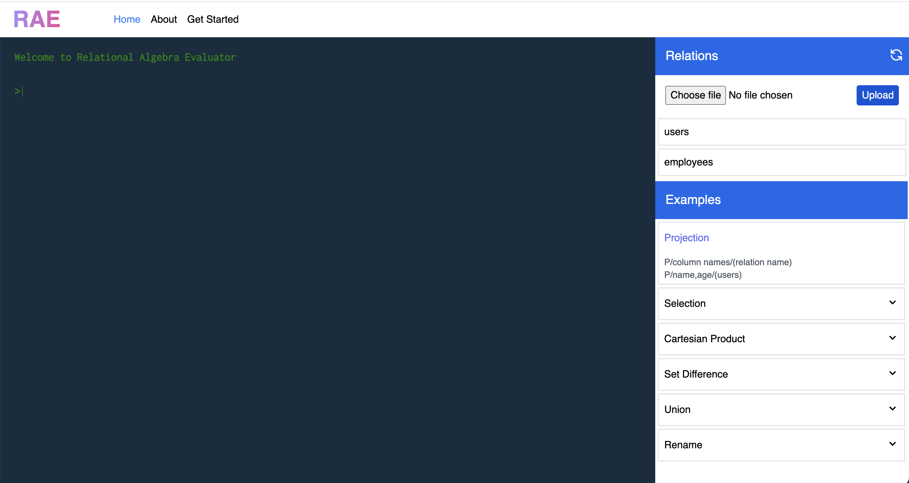

# Relational Algebra Evaluator

<div >

</div>
🔥 Relational algebra evaluator

## Table of Contents

- [Install](#install)
- [Usage](#usage)
- [Api](#api)
- [Guides](#guides)
- [Operations](#guides)
  - [Projection](#projection)
  - [Selection](#selection)
  - [Cartesian Product](#cartesian-product)
  - [Union](#union)
  - [Set Difference](#set-difference)
  - [Rename](#rename)

## Install

```bash
npm i relational-algebra-evaluator
```

## Usage

```js
import { Rae } from 'relational-algebra-evaluator';

// create an instance of Rae
const rae = Rae.getInstance();

// relational algebra expression
const expression = 'P/title,author/(book)';

// execute the expression
const result = rae.execute(expression);
```

## API

### Rae.getInstance(options)

Generate new Instance of Rae

**options**  
| Key | value | description |
| :-: | -- | :----:|
| `dataDir` | `../data/` | Location to save the temporary data for current session |
| `sessionId` | `null` | Session Id of current session |

### Rae.setDataDir

Set session data directory

```js
// create an instance of Rae
const rae = Rae.getInstance();
rae.setDataDir('../data');
```

### Rae.addRelations

Add Custom relations to session data

```js
// create an instance of Rae
const rae = Rae.getInstance();
const customRelations = {
  users: [
    { id: '1', name: 'Jack' },
    { id: '2', name: 'Bob' },
  ],
};

rae.addRelations(JSON.stringify(customRelations));
```

### Rae.getAllRelations

Get All Relations

```js
// create an instance of Rae
const rae = Rae.getInstance();
const relations = rae.getAllRelations();
```

### Rae.execute

Execute relational Algebric expression

```js
// create an instance of Rae
const rae = Rae.getInstance();

// relational algebra expression
const expression = 'P/title,author/(book)';

// execute the expression
const result = rae.execute(expression);
```

## Guides

### Adding your own relations

There are some relations already added for the current session. To add a custom relation to the current session, addRelations method help to add custom relations to current session. Custom relations should be a json format, sample schema for the json file is given below.

```json
{
	"relation-name-here":  [
	  { "key": "value" }
    ...
  ]
}
```

### View All Relations

To view all relations via executing command

```bash
show relations
```

### View Relation/Variable Data

To view all data in a relation or variable by executing command view
**Example:**

```bash
view relation-name
```

### Creating variable

Creating variables can be helpful for the user to save the result of one operation and it can be used in future.
**Example:**

```bash
  var userLocation = P/name, address/(users)
  P/name/(userLocation)
```

In the above example, the name and address column from users’ relation is projected then saved the result to a variable. In the second command, it takes the name column from the variable userLocation using projection.

### Working with nested Relational Algebraic Operations

A Relational Algebraic Evaluator can execute operators recursively. If the entered relation algebraic expression contains a nested operation, then the system will go deep into the last nested operation and start to evaluate it until it reaches the parent expression.
**Example:**

```bash
S/name=Bob/( ( P/name, address/(users) ) )
```

In the above command initially, it will do the nested projection operation and then it will execute the selection operation.

## Operations

### Projection

**Example:**

```bash
P/title,author,publication/(book)
```

### Selection

**Example:**

```bash
S/publication=AMC/(book)
```

### Cartesian Product

**Example:**

```bash
X(maleTable,femaleTable)
```

### Union

**Example:**

```bash
U( (P/id,name/( (S/city=Pune/(salesPeople)) )), ( P/id,name/( (S/city=Pune/(customers)) ) ) )
```

### Set Difference

**Example:**

```bash
SD(tableA, tableB)
```

### Rename

**Example:**

```bash
R/newRelationName/(users)
```

## Author

Maneksh M S
